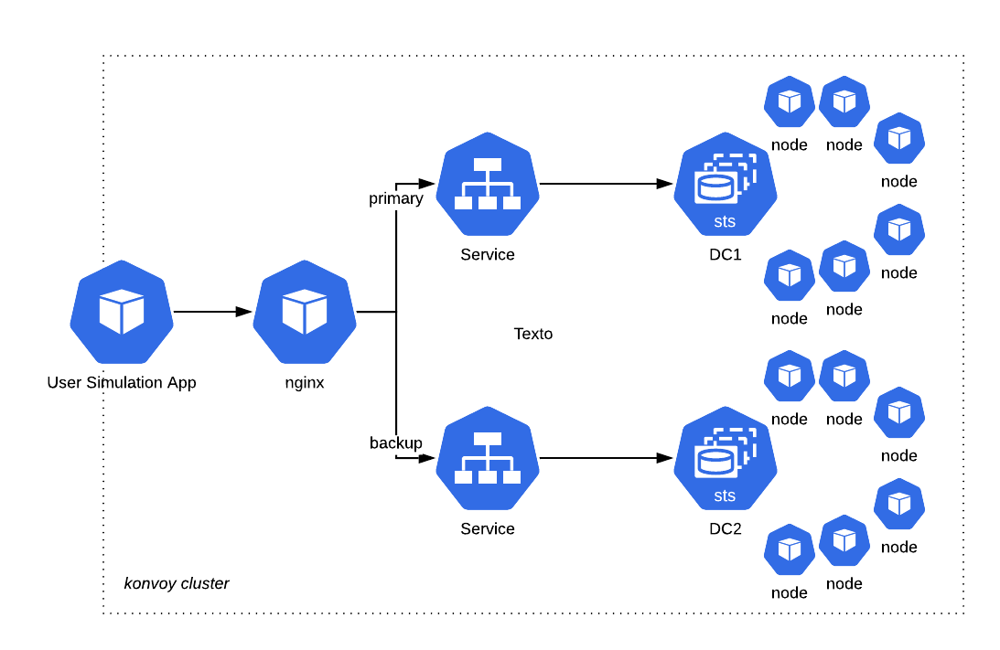

## Cassandra Failover Demo

 


### Setup

Checkout the KUDO Cassandra github repo
```
git clone https://github.com/mesosphere/kudo-cassandra-operator.git 
cd kudo-cassandra-operator
git checkout node-replace-poc
```

Create namespaces for the two Cassandra rings

```
kubectl create namespace cassandra-ring1
kubectl create namespace cassandra-ring2
```

Install the KUDO Cassandra operator in the ring1 namespace

```
kubectl kudo install ./operator --namespace cassandra-ring1 --parameter-file ./images/topology/aws-topology-ring1.yaml
```

Watch the cassandra pods till we have the cluster up and healthy

```
kubectl get pods -w -n cassandra-ring1
```

Install the KUDO Cassandra operator in the ring2 namespace. Add the seed nodes of the ring1 cluster as external seed nodes to the ring2 cluster.
The DNS for the pods in ring1 are cassandra-instance-ring1-node-{n}.cassandra-instance-svc.cassandra-ring1.svc.cluster.local

```
kubectl kudo install ./operator --namespace cassandra-ring2 --parameter-file ./images/topology/aws-topology-ring2.yaml --parameter EXTERNAL_SEED_NODES="\[cassandra-instance-ring1-node-0.cassandra-instance-svc.cassandra-ring1.svc.cluster.local, cassandra-instance-ring1-node-1.cassandra-instance-svc.cassandra-ring1.svc.cluster.local, cassandra-instance-ring1-node-2.cassandra-instance-svc.cassandra-ring1.svc.cluster.local\]"
```

Watch the cassandra pods till we have the cluster up and healthy

```
kubectl get pods -w -n cassandra-ring2
```

Verify that the cluster in the ring2 namespace see Cassandra nodes of both namespaces. `nodetool` status should report two datacenters with 3 nodes each

```
kubectl exec -n cassandra-ring2 cassandra-instance-ring2-node-0 -- nodetool status
```

Update the KUDO Cassandra operator in the ring1 cluster to include the seed nodes of the ring2 cluster

```
kubectl kudo update --instance cassandra-instance --namespace cassandra-ring1 --parameter EXTERNAL_SEED_NODES="\[cassandra-instance-ring2-node-0.cassandra-instance-svc.cassandra-ring2.svc.cluster.local, cassandra-instance-ring2-node-1.cassandra-instance-svc.cassandra-ring2.svc.cluster.local, cassandra-instance-ring2-node-2.cassandra-instance-svc.cassandra-ring2.svc.cluster.local\]"
```

Watch the cassandra pods till we have the cluster up and healthy

```
kubectl get pods -w -n cassandra-ring1
```

Verify that the cluster in the ring1 namespace see Cassandra nodes of both namespaces. `nodetool` status should report two datacenters with 3 nodes each

```
kubectl exec -n cassandra-ring1 cassandra-instance-ring1-node-0 -- nodetool status
```

Install the workload

```
kubectl apply -f ./images/manifests/
```

Get the benchmark endpoint

```
http://konvoy-cluster-url/verizon/poc/
```

Start with small test against the host `http://shopping-app-service` and check the shopping cart with 

```
kubectl exec -ti -n cassandra-ring1 cassandra-instance-ring1-node-0  -- cqlsh -e "SELECT * FROM shopping.carts"
```

### Delete the whole ring1

```
kubectl delete pod -n cassandra-ring1 cassandra-instance-ring1-node-0 cassandra-instance-ring1-node-1 cassandra-instance-ring1-node-2
```

